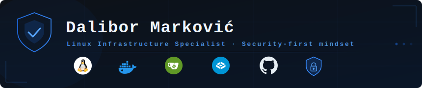

---

### O meni

Specijalista za sigurnost Linux infrastrukture. Fokusiran na izgradnju stabilnih, kontejnerizovanih self-hosted sistema — sa naglaskom na minimalni napadni prostor, rigorozne sigurnosne polise i automatizaciju administracije.

---

### Fokus

| Oblast | Opis |
|---|---|
| 🔐 System Hardening | Revizija sigurnosti OS-a, SSH restrikcije i kontrola mrežnog pristupa |
| 🚨 Intrusion Prevention | Aktivna zaštita, monitoring logova i prevencija automatizovanih napada |
| 🐳 Docker ekosistem | Kontejnerizacija, Compose, izolacija i sigurnost servisa |
| ☁️ Self-hosted infrastruktura | TrueNAS, Gitea, privatni cloud stack |
| 🗄️ Database Administration | Upravljanje i optimizacija baza podataka |
| ⚙️ Automatizacija | Skriptovanje, monitoring i optimizacija radnih tokova |

---

### Kontakt

📧 [dalibor31@gmail.com](mailto:dalibor31@gmail.com) · 🌐 [vm-net.in.rs](https://vm-net.in.rs)

---

<i>"Siguran sistem nije proizvod sreće — to je rezultat discipline i dobre arhitekture."</i> 
